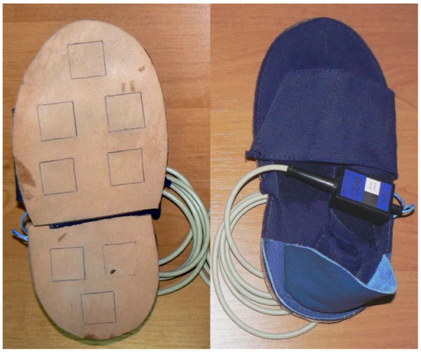

# Introduction
&nbsp; Parkinson’s disease (PD) is a progressive neurodegenerative disorder characterized by a variety of motor and non-motor symptoms. Early and accurate diagnosis of PD remains a significant challenge in the medical field. Gait analysis powered by advanced signal pro- cessing and machine learning techniques, has emerged as a promising approach to detect PD due to its ability to capture subtle changes in motor functions that are characteristic of the disease.
# Gait Data and Analysis
## What is gait analysis?
&nbsp; Gait analysis is a method used to assess and understand the mechanics of human walk- ing. It involves the systematic study of locomotion, primarily through the observation and measurement of bodily movements and the forces involved in walking. In clinical settings, gait analysis is employed to diagnose, plan treatment, and monitor the progres- sion of various conditions that affect physical movement, including neurological disorders, musculoskeletal issues, and injuries.
## Why gait analysis is efficient in PD diagnosis?
&nbsp; Gait analysis is particularly relevant in the context of PD because the degeneration of dopamine-producing neurons in the brain, which is a hallmark of Parkinson’s disease, attribute to the changes in gait. Dopamine is crucial for smooth, purposeful muscle movement and coordination. Therefore, people with PD have the following symptoms:
* __Reduced Arm Swing:__ due to bradykinesia (slowness of movement), there’s often a reduction in the natural arm swing during walk.
* __Shorter Stride Length:__ the reduced stride length is partly due to muscle stiffness and bradykinesia.
* __Postural Instability:__ there’s often a stooped and leaned forward posture, which can affect balance and stability.
* __Shuffling Steps:__ the feet can barely leave the ground. due to diminished movement control and a struggle to lift the feet properly.
* __Freezing of Gait:__ This is a unique symptom where individuals temporarily feel as if their feet are glued to the ground, especially while starting to walk or when turning.
* __Slower Walking Speed:__ Overall, the walking speed is generally slower due to the combination of these factors.
## Gait Data in this research
&nbsp; In the research, I used ”Gait in Parkinson’s Disease” from PhysioNet[1][2]. The dataset includes 16-channel VGRF data, which measures the force exerted by the feet against the ground during walking. 93 patients with Parkinson’s Disease and 73 healthy controls wore 8 force sensors on both their feet and performed walking experiments. Here is the illustration of the possible system that would be able to collect 16-channel VGRF data:

